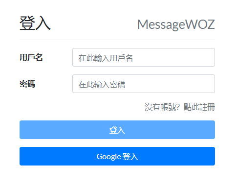
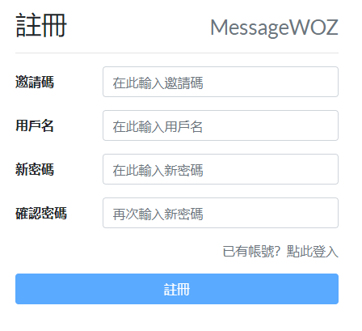
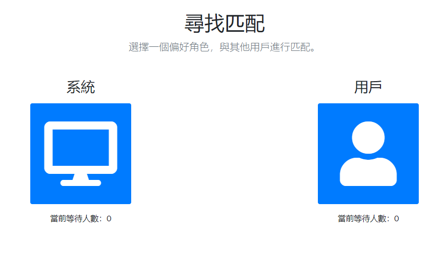
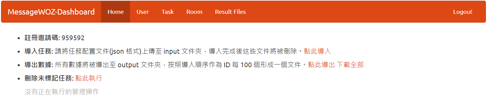
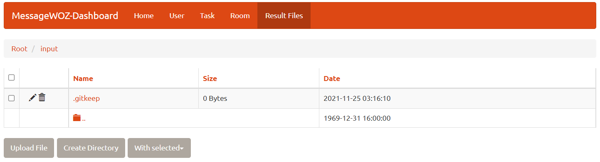
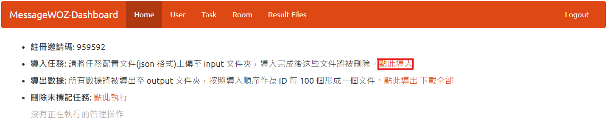
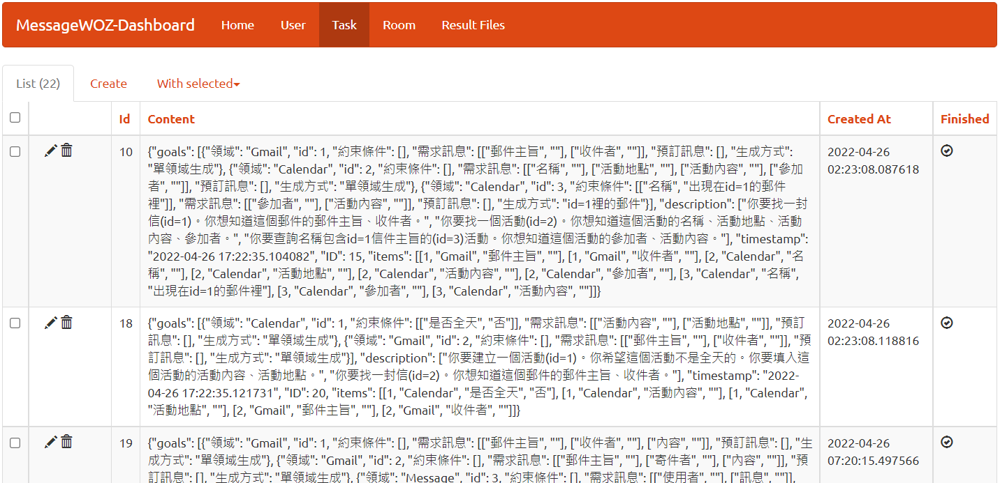

# 多領域任務導向用戶語音助理對話收集系統


## Outline
- [環境配置](#Environment-setup): 如何配置此環境
- [操作指南](#操作指南): 詳細敘述各頁面之操作
    - [Login](#Login): 登入介面
    - [Register](#Register): 註冊頁面，註冊帳號
    - [Match](#Match): 配對介面
    - [Admin](#Admin(管理員)): 管理後台
- [任務生成](#Task-Generation): 如何產生任務文件 `task.json` 


<h2 id="Environment-setup">Environment setup</h2>

### Requirements
* python >= 3.6

### Development Startup

Before clone this repo, you need to install Redis on PC(Linux-Ubuntu)
```bash
# download redis package
curl -fsSL https://packages.redis.io/gpg | sudo gpg --dearmor -o /usr/share/keyrings/redis-archive-keyring.gpg

echo "deb [signed-by=/usr/share/keyrings/redis-archive-keyring.gpg] https://packages.redis.io/deb $(lsb_release -cs) main" | sudo tee /etc/apt/sources.list.d/redis.list

sudo apt-get update

# the redis will running when it is installed successfully
sudo apt-get install redis
```


Run the following command and visit http://0.0.0.0:5000 (boardcast).

```bash
# clone the repo in branch GCPlogin
git clone -b GCPlogin --single-branch https://github.com/TedYeh/messageWOZ.git

# change the directory 
cd messageWOZ

# install dependencies
python3 -m pip install -r requirements.txt

# initialize the database
python3 resetdb.py

# start the server
python3 run.py
```
Or you can change the code 
```python
socket_io.run(app, host='0.0.0.0', port=5000)
```
to
```python
socket_io.run(app, host='127.0.0.1', port=5000)
```
in `data_labeling/__init__.py` to run the system in your localhost.

<h2 id="操作指南">操作指南</h2>

<h3 id="Login">Login</h3>
運行系統後，會進入到登入畫面
可進行普通用戶登入或Google用戶登入



選擇 **`Google 登入`** 來讀取Gmail、Calendar等資訊
> 若要更改為其他GCP網域，請修改 `data_labeling/routes` 目錄中的 `gcalendar.py`、`gmail.py` 及 `services.py`

<h3 id="Register">Register</h3>

若要使用普通用戶登入，點選`沒有帳號？點此註冊`來註冊帳號。

邀請碼為 `959592`，可以修改 `data_labelling/app.py` 的 `invitation_code`。



<h3 id="Match">Match</h3>

使用普通用戶才可進入對話匹配介面，進入介面後有**至少有一人選擇系統(助理)端，一人選擇用戶(使用者)端**，此时系統便會自動完成配對並進入對話介面。

提示：若在本地端 (http://localhost:5000) 測試此系統，可以使用 Chrome 的無痕視窗同時登入兩個帳號。




各對話頁面及設計請參考[MessageWOZ資料標註系統操作說明.pdf](MessageWOZ資料標註系統操作說明.pdf) 及 `data_labeling/templates` 目錄下的`.html`。

<h3 id="Admin(管理員)">Admin(管理員)</h3>

帳號名稱：root，密碼：root

登入後即進入管理員介面(控制台) 



管理員可以在控制台導入預先定義的任務，並導出已完成的對話。

+ 導入任務步驟
    1. 選擇 `Result Files` 分頁，並進入 `inputs` 目錄，上傳任務定義文件 `tasks.json`。

    

    2. 再回到管理首頁，點擊`點此導入`連結導入任務。若導入成功，系統會告知導入成功的任務數量。

    

    3. 可到 `Task` 分頁查看詳細的任務敘述。

    

+ 導出對話
    1. 在首頁點選`點此導出`即可導出已完成任務對話。

<h2 id="Task-Generation">Task Generation</h2>

在 `messageWOZ` 目錄下執行以下指令:
```bash
# move to goal_generation directory
cd goal_generation

# run sentence_generation.py to get {num} of taks
python3 sentence_generation.py --num 100
```
執行指令後便會在 `goal_generation` 目錄下產生 `goal_task.json`

最後進入管理介面即可將 `goal_task.json` 導入系統進行對話。
